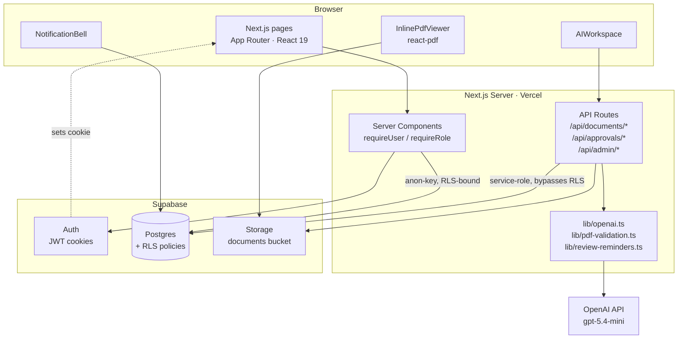

# AI Document Review Assistant

A document-review SaaS where employees submit PDFs, reviewers approve or reject with passage-level comments, and admins manage the system. Includes an OpenAI-powered assistant for summarization and Q&A, plus digital signature with integrity verification.

> **Graduation project** — Trần Minh (23BI14290), University of Science and Technology of Hanoi, 2026.

- **Live demo**: https://ai-document-bot.vercel.app/

See [`INSTALL.md`](./INSTALL.md) for step-by-step setup and run instructions.

---

## Features

- **Multi-role workflow** — `employee` / `reviewer` / `admin`, enforced at both the page level (auth helpers) and the database level (Postgres Row-Level Security).
- **Multi-version uploads** — every PDF round of revision is preserved; latest vs. superseded versions are clearly badged.
- **Multi-reviewer rounds** — submitter picks N reviewers per round; document is approved only when *all* reviewers approve, rejected immediately if any reject. Resubmission opens a new round with full history preserved.
- **Inline PDF viewer** with passage-level highlights and comments (`react-pdf` + page-relative bounding-rect coordinates so highlights survive zoom/resize).
- **AI Assistant** (real OpenAI, not mocked) — extract text, generate summary / key points / risk notes via structured-output JSON schema, ask grounded questions about the document.
- **Multi-party digital signatures** — WebAuthn / FIDO2 with hardware-bound TPM keys (ECDSA P-256). The owner signs at submission and each reviewer signs at approval, using the file's SHA-256 hash as the signing challenge. A verify-integrity button and a printable certificate page re-check every signature, reporting hash-match and cryptographic validity separately so post-signing tampering is detectable.
- **Review SLAs** — submitter picks a deadline; dashboard color-codes overdue (red) / due-soon (amber) / normal (teal); lazy in-app reminders fire when reviewers load the dashboard.
- **Notifications** — header bell with unread badge + dropdown, updated live via Supabase Realtime; in-app reminders for review assignment, progress, overdue, approval, and rejection, mirrored to email through Brevo.
- **Per-user AI rate limiting** — the AI endpoints share a Postgres-backed fixed-window limit (default 20 calls / 10 min per user) to bound OpenAI cost; fails open so a limiter fault never disables the feature.
- **Admin panel** — user role management, document oversight (with cascade delete), audit logs with filters, advanced search across extracted document text.
- **Dashboard analytics** — CSS-only charts (no library): documents by status, documents by month, approval/rejection ratio.

For setup and run instructions, see [`INSTALL.md`](./INSTALL.md).

---

## Architecture



**Key architectural choices**:

- **Two database clients on the server.** The anon-key client (`lib/supabase/server.ts`) is used for all reads from server components and respects RLS. The service-role client (`lib/supabase/admin.ts`) is used only inside API routes for privileged writes (inserts into `documents`, `document_versions`, `audit_logs`) — bypassing RLS deliberately, but only after the route has authenticated the user and validated the action.
- **RLS is real, not theatrical.** `documents` and `document_versions` SELECT policies restrict to `owner OR assigned-reviewer OR admin`. Even with the anon key leaked, a malicious client cannot enumerate other users' documents.
- **Upload pipeline is staging-then-validate.** The browser uploads to a `_staging/` path under the user's RLS-allowed prefix, then a server route fetches the magic bytes via a Range request, validates `%PDF-` + size, and only then moves the file to its final path and inserts the row. Skipping the API call cannot bypass validation because the row insert requires the service role.

---

## Tech stack

| Layer | Choice |
| --- | --- |
| Framework | Next.js 16 (App Router, Turbopack, React Server Components) |
| UI | React 19, Tailwind v4 (custom design system) |
| Language | TypeScript (strict) |
| Database | Supabase Postgres + Row-Level Security |
| Auth | Supabase Auth (cookie-based JWT) |
| File storage | Supabase Storage |
| PDF text extraction | `pdf-parse` (server-side) |
| PDF rendering | `react-pdf` (client-side, with worker copied via postinstall hook) |
| AI | OpenAI API (`gpt-5.4-mini` by default; structured outputs for summary) |
| Hosting | Vercel |

---

## Local setup

**Prerequisites**: Node.js ≥ 20, an OpenAI API key, and a Supabase project (URL + anon key + service-role key).

1. Clone and install:
   ```bash
   git clone <repo-url>
   cd ai-document-bot
   npm install
   ```
2. Create `.env.local` in the project root:
   ```
   NEXT_PUBLIC_SUPABASE_URL=https://<your-project>.supabase.co
   NEXT_PUBLIC_SUPABASE_ANON_KEY=<anon-key>
   SUPABASE_SERVICE_ROLE_KEY=<service-role-key>
   OPENAI_API_KEY=sk-...
   OPENAI_MODEL=gpt-5.4-mini
   ```
3. Set up the database. [`SUPABASE_CONTEXT.md`](./SUPABASE_CONTEXT.md) documents the full schema (tables, columns, foreign keys, RLS policies, and storage layout); the [`migrations/`](./migrations) folder holds the runnable SQL for the signing, content-hash, and AI-rate-limit additions. Apply the schema in the Supabase SQL editor, then run each migration file once.
4. Run the dev server:
   ```bash
   npm run dev
   ```
   Open http://localhost:3000 and register an account. To grant yourself admin/reviewer roles, update the `profiles.role` column directly in Supabase Studio.

---

## Project structure

```
app/                        Next.js App Router
  api/                      Server-only API routes (validation + service-role writes)
  admin/                    Admin-only pages
  dashboard/                Per-user dashboard
  documents/                Document list + detail
  reviews/                  Reviewer queue
  notifications/            Full notifications inbox
components/                 Client + server components
  AIWorkspace.tsx           AI summary/Q&A UI
  InlinePdfViewer.tsx       react-pdf + highlight system
  NotificationBell.tsx      Header bell with dropdown
  ...
lib/
  openai.ts                 OpenAI client wrapper (structured outputs, error mapping)
  pdf-validation.ts         Magic-byte + size validation via Range request
  review-reminders.ts       Lazy overdue-reminder fanout
  rate-limit.ts             Per-user AI rate limiting (Postgres-backed)
  webauthn/                 WebAuthn config, verification, AAGUID registry
  supabase/                 SSR + admin clients, auth helpers
migrations/                 Runnable SQL for signing, content-hash, rate-limit
INSTALL.md                  Setup + run instructions
SUPABASE_CONTEXT.md         DB schema + RLS policy reference
```

---

## Documentation

- [`INSTALL.md`](./INSTALL.md) — setup and run instructions (live demo or local from source).
- [`SUPABASE_CONTEXT.md`](./SUPABASE_CONTEXT.md) — database schema, foreign keys, and RLS policies.

---

## License

This project was built as an academic graduation submission. All rights reserved by the author.
